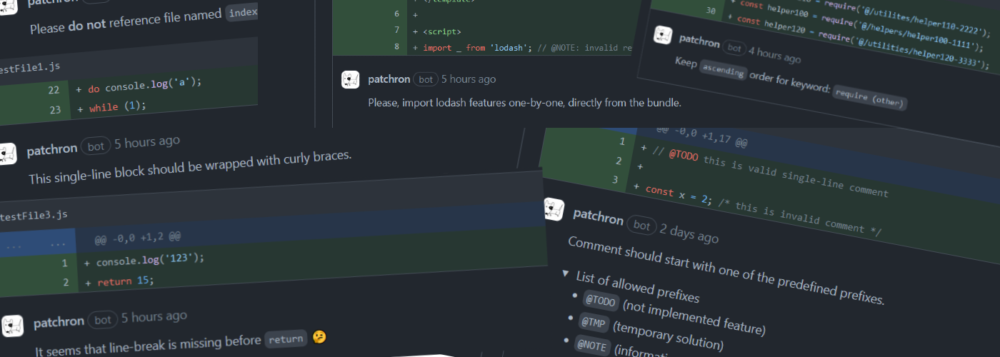

# 🐶 Patchron

<p>


<a href="./.github/AVAILABLE_RULES.md" target="_blank">
    
</a> <a href="./.github/DEV_OVERVIEW.md" target="_blank">
    
</a>
</p>

<p align="justify">
GitHub bot 🤖 that performs "early" pull request code review. 
</p>

-   versioned rules
-   built with [Probot](https://probot.github.io/docs/) framework
-   easy to configure and [expand](./.github/DEV_OVERVIEW.md)
-   with tests (Jest) and type definitions (jsdoc)
-   wrapped with [own context](./src/builders/PatchronContext.js) to improve logging and accessing Probot context

Disclaimers

> review is based upon patches which contain limited number of information. Due to that, some comments might be unrelevant to the situation. Despite of that, it comes to clicking resolve button while at the same time reviewers don't have to focus on simple things.

> app was tested on common Prettier configuration tabWidth: 4, printWidth: 80

## 1. Setup

### 1.1. Node

```sh
# 0. Fork or Download

# 1. Install dependencies
npm install

# 2. Configure app

# 3. Run the bot
npm start

# 4. Follow further instructions to finish configuration
https://github.com/settings/apps

```

### 1.2. Docker

```sh
# 1. Build container
docker build -t patchron .

# 2. Start container
docker run -e APP_ID=<app-id> -e PRIVATE_KEY=<pem-value> patchron

e.g. more options:
-e SENDERS=<usernames-separated-by-comma>
-e MAX_COMMENTS_PER_REVIEW=<number>
```

## 3. Configuration

#### Review logic options

| Property                                    | Type (default)               | Description                                                                                                                                                                 |
| :------------------------------------------ | :--------------------------- | :-------------------------------------------------------------------------------------------------------------------------------------------------------------------------- |
| `IS_GET_FILES_REQUEST_PAGINATED`            | boolean (`false`)            | Controls files fetching strategy. Unpaginated response includes a maximum of 3000 files which is sufficient in 99.9999999999% of cases.                                     |
| `DELAY_BETWEEN_COMMENT_REQUESTS_IN_SECONDS` | Number (`3`)                 | After review is done, delays time between each comment request to not overload API. Creating content too quickly using this endpoint may result in secondary rate limiting. |
| `IS_OWNER_ASSIGNING_ENABLED`                | boolean (`true`)             | When true, PR owner will be automatically assigned on issueing pull request.                                                                                                |
| `IS_REVIEW_SUMMARY_ENABLED`                 | boolean (`false`)            | When true, at the end of the PR review, Patchron posts summary that contains various information e.g. how many comments were posted.                                        |
| `IS_STORING_LOGS_ENABLED`                   | boolean (`false`)            | When true, logs are also stored physically in `/.logs` directory.                                                                                                           |
| `MAX_COMMENTS_PER_REVIEW`                   | Number (`25`)                | Limits number of comments that can be posted in single review under single PR.                                                                                              |
| `SENDERS`                                   | Array&lt;`string`&gt; (`[]`) | Allows to limit pull requests reviews to certain users. Pass GitHub usernames.                                                                                              |
| `APPROVE_PULL_ON_EMPTY_REVIEW_COMMENTS`     | boolean (`true`)             | When true, approves pull request on empty review comments.                                                                                                                  |

#### Other options

| Property                   | Default                     | Description                                                                                                                                           |
| :------------------------- | :-------------------------- | :---------------------------------------------------------------------------------------------------------------------------------------------------- |
| `NODE_ENV`                 | String (`.example`)         | specifies environment in which app is running.                                                                                                        |
| `RULES_CONFIGURATION_URL`  | String (` `)                | When provided, attempts to fetch rules configuration from given URL. URL should point to `.json` file ([example structure](./src/config/rules.json)). |
| `RULES_CONFIGURATION_PATH` | String (`src/config/rules`) | Path to rules configuration file stored in the project. Used in testing environment and when `RULES_CONFIGURATION_URL` is not specified.              |

## 4. Links

-   [Probot docs](https://probot.github.io/docs/)
-   [Octokit Rest API](https://octokit.github.io/rest.js)
-   [Deployments API example](https://developer.github.com/v3/repos/deployments/)
-   [Pino (logger)](https://getpino.io/#/)
-   [GitHub API - best practices](https://docs.github.com/en/rest/guides/best-practices-for-integrators)
-   [GitHub API - rate limits](https://docs.github.com/en/developers/apps/building-github-apps/rate-limits-for-github-apps)
-   [GitHub API - pulls](https://docs.github.com/en/rest/reference/pulls)
-   [Default picture](https://pixabay.com/vectors/dog-pet-hound-black-eye-animal-151123/)

## 5. Name origin

Name simply comes from merging two words: Patch and [Patron](<https://en.wikipedia.org/wiki/Patron_(dog)>) 🐶
